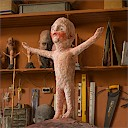
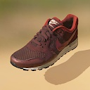
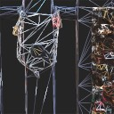

Umbra support for three.js
==========================

**Render massive 3D models in real time with three.js**

This is an extension to three.js that allows you to stream in and render large models using [Umbra's cloud service](https://www.umbra3d.com/).

**Live Demos**

<a href="https://umbrasoftware.github.io/umbrajs-three/examples/studio.html" target="_blank"></a>
<a href="https://umbrasoftware.github.io/umbrajs-three/examples/shadows.html" target="_blank"></a>
<a href="https://umbrasoftware.github.io/umbrajs-three/examples/streaming_position.html" target="_blank"></a>

Click on any of the images above to see Umbra running in your browser.


[Getting Started](https://github.com/UmbraSoftware/umbrajs-three/wiki/Getting-Started) &mdash;
[Example code](https://github.com/UmbraSoftware/umbrajs-three/tree/master/examples) &mdash;
[Wiki](https://github.com/UmbraSoftware/umbrajs-three/wiki)

## Usage

Download the library from the `dist/` directory of this repository, or [build it yourself](https://github.com/UmbraSoftware/umbrajs-three/wiki/Building-the-library). Then add it to your HTML:

```html
<script src="umbrajs-three.js"></script>
```

First create a three.js renderer and then initialize Umbra and and pass in a three.js renderer as an argument:

```javascript
let Umbra = await UmbraRuntime.initWithThreeJS(renderer)
let model = Umbra.createModel({
  token: 'my-own-api-key',
  projectID: '1005906',
  modelID: '699980469', })
```

The `projectID` and `modelID` values identify the 3D model to be streamed.

Then you can create a three.js scene and add our model to it:

```javascript
var scene = new THREE.Scene()
scene.add(model)
```

Finally, inside your animation loop you must update the runtime:

```javascript
Umbra.update()
```

This call incrementally downloads and unpacks meshes, and it must be called every frame.

**Running examples locally**

Download this repository and run `npx http-server`. Then open [the player example](http://127.0.0.1:8080/examples/player.html?key=pubk-a33b4cb8-6643-46a7-a3ff-c768c812b3b6&project=1005906&model=699980469).
You should see a red shoe.

**Uploading models**

You need a free trial account to upload models to Umbra's cloud. Contact [sales@umbra3d.com](mailto:sales@umbra3d.com) to start your trial.
